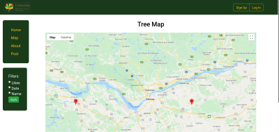

# **treepeep**

treepeep is a fun interactive social media application to connect tree lovers from around the world! Members can upload pictures of their trees to the site, which will then appear in the feed. They can also geotag their trees, which will be stored in our database and viewable in the Maps section, which integrates with the Google Maps API to show what our users have found. 

# **features**

## treefeed

Our treefeed lets any user view the trees that posters have seen and captured. Each post allows for the ability to like it and comment if you so feel. This keeps our community active and engaged with one another. 

### feed

### comment

## treepost

As a user, you also have the ability to contribute to our treefeed! All you need to do is find a worthy tree, take a picture or two, and hit Post on our site. From there, you can fill in all the necessary details to make your tree pop with other users.

## treemap

Another special feature of treepeep is the extra connection our users can make to trees in the real world. As soon as our Map is selected, a beautiful Google Map filled with our user's posts comes to life. Here, you can see where in the world these trees are from.

# **getting started**

To get started with treepeep, a few simple things need to be done.

## install yarn

Why repeat what's already been written down? To install the yarn package manager, visit the [official yarn site](https://yarnpkg.com/lang/en/docs/install/#windows-stable) and follow their instructions!

## run yarn

 Next, to get the app set up and running, the following commands sould be put into the terminal on your computer.

`yarn install`

`yarn start`

## visit the site

Finally, all that's left to do is find open the app in your favorite web browser! Just go to `localhost:3000/`, to access treepeep! 

## enjoy

All that's left to do is use our app! Now you can sign up and start posting to show off your trees. Have fun!

# **future improvements and issues**

Although we love treepeep, there is always room for improvement in the way we do things, and what we could be doing. This section is meant to point out any features we plan to implement in the future (but don't quite right now), and list any known bugs in our system.

## features

### **_Fleshed out Text_**

We love our site, but our content could use some work. Because of that, we're actively working to give it even more character.

### **_Account Logging_**

Although you can play around on the site, at the moment you aren't allowed to be an official treepeep! This is both sad and something that is of the utmost importance to the existing treepeeps.

### **_Form Logging_**

This pertains to the posts you make. As our backend is still under development, the site will feel barren until we give it some permanent data to show. 

## bugs

As of right now, our expert exterminators haven't identified any risky ~~bugs~~ termites that could risk the structure and integrity of the system!